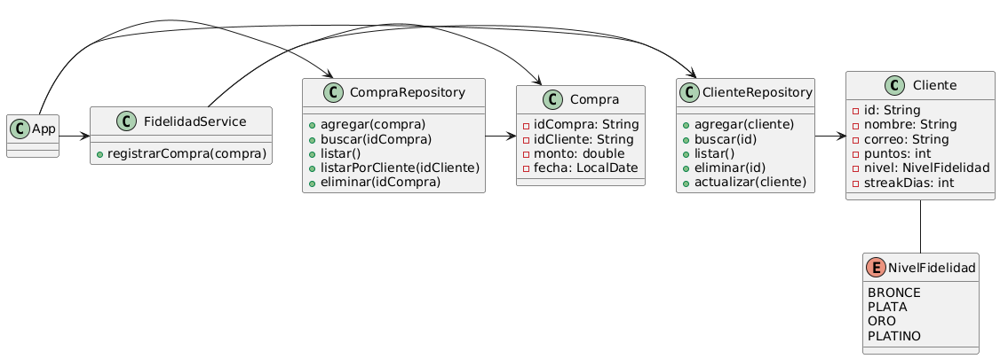

# Tarjeta de Fidelidad Gamificada

Este proyecto implementa un sistema de fidelización para una cadena de tiendas de conveniencia. A través de una interfaz de línea de comandos, permite gestionar clientes, registrar compras, acumular puntos y subir de nivel según reglas de negocio definidas.

---

## Funcionalidades

- Gestión completa de clientes (crear, listar, actualizar, eliminar)
- Registro y seguimiento de compras
- Acumulación de puntos con bonus por fidelidad
- Sistema de niveles: Bronce, Plata, Oro y Platino
- Interfaz de consola con menús interactivos

---

## 🧩 Diagrama de clases UML



---

## Ejemplo de salida de tests

```bash
[INFO] -------------------------------------------------------
[INFO]  T E S T S
[INFO] -------------------------------------------------------
[INFO] Running com.fidelidad.ClienteRepositoryTest
[INFO] Tests run: 4, Failures: 0, Errors: 0, Skipped: 0
[INFO] Running com.fidelidad.ClienteTest
[INFO] Tests run: 2, Failures: 0, Errors: 0, Skipped: 0
[INFO] Running com.fidelidad.CompraRepositoryTest
[INFO] Tests run: 4, Failures: 0, Errors: 0, Skipped: 0
[INFO] Running com.fidelidad.FidelidadServiceTest
[INFO] Tests run: 2, Failures: 0, Errors: 0, Skipped: 0
[INFO] Running com.fidelidad.NivelFidelidadTest
[INFO] Tests run: 2, Failures: 0, Errors: 0, Skipped: 0
[INFO] 
[INFO] Results:
[INFO]
[INFO] Tests run: 14, Failures: 0, Errors: 0, Skipped: 0
```

---

## Licencia
MIT License
(c) 2025 Esteban Castillo

---

# Instrucciones de compilación y ejecución

## Requisitos previos

- Java 21+
- Maven 3.8+

---

## Entra a la carpeta principal

```bash
cd TarjetaFidelidad
```

---

## Compilar el proyecto

```bash
mvn compile
```

---

## Ejecutar la aplicación

```bash
mvn exec:java
```

---

## Ejecutar los tests

```bash
mvn test
```

---

## Ver reporte de cobertura

```bash
mvn verify
```

Luego abre el archivo `target/site/jacoco/index.html` en un navegador web, para ver el reporte visual.

---

# ¿Qué tipo de cobertura he medido y por qué?

Utilicé **JaCoCo** para medir cobertura de código (**Code Coverage**) en dos aspectos principales:

- **Cobertura de líneas de código**: Asegura que la mayor parte de la lógica relevante del sistema es ejecutada durante las pruebas.
- **Cobertura de ramas**: Verifica que las diferentes condiciones y bifurcaciones lógicas son testeadas.

Esto es importante para garantizar la calidad y robustez del software, identificando posibles caminos no cubiertos y mejorando la confiabilidad general.

En mi reporte JaCoCo, la cobertura fue del **42% de líneas** y **21% de ramas**, esta cobertura baja se debe principalmente al código de consola no cubierto.

